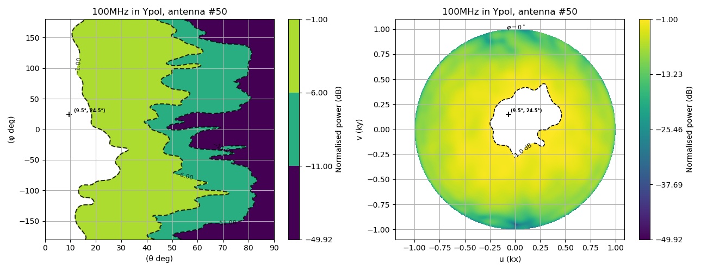
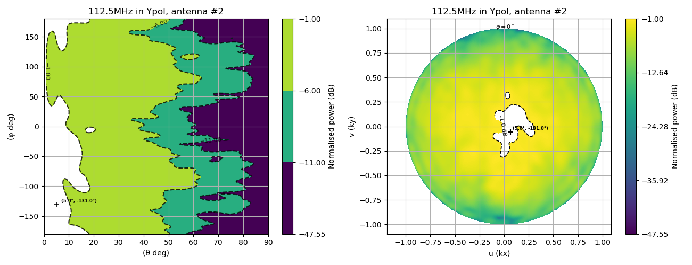
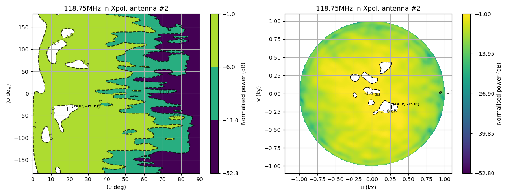
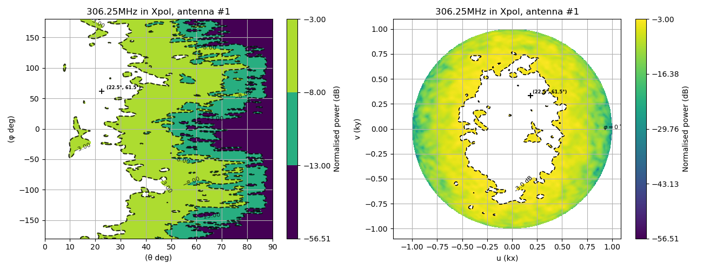

# EEP Problematic Region Detector

## Overview
The **EEP Problematic Region Detector** processes FEKO simulation outputs to identify problematic regions in Embedded Element Pattern (EEP) data. The program supports the visualization and automatic detection of regions where EEP values fall below a given threshold. It was tested on simulated data from the SKA-low AAVS3 P-Vogel layout, covering 92 frequencies within a 45° field of view, ranging from 71.875 MHz to 315 MHz with varied cadences. The program provides the following functionalities:

- Computes and stores normalized EEP values.
- Generates and saves EEP plots in polar and UV planes.
- Detects problematic regions based on a user-defined threshold.

## Repository Structure
```
eepnn/
│── Problematic_Region_Detector_Files/
│   ├── codes/
│   │   ├── detect.py            # Main script to process EEP data
│   │   ├── functions.py         # Contains all necessary functions
│   │   ├── demo.ipynb           # Jupyter Notebook for demonstration
│   ├── requirements.txt         # List of required dependencies
│   ├── example_results          # example outputs

```

### Files and Their Roles
- **`functions.py`**: Contains functions for computing E-norms, plotting EEPs, and detecting problematic regions.
- **`detect.py`**: Main script that uses `functions.py` to process EEP data.
- **`demo.ipynb`**: Jupyter Notebook demonstrating how to set up and use the program.
- **`requirements.txt`**: Lists the dependencies required to run the project.

## Installation

### Clone the Repository
```bash
git clone https://github.com/maria-kovaleva-australia/eepnn.git
```

### Install Dependencies
Using pip:
```bash
cd eepnn/Problematic_Region_Detector_Files && pip install -r requirements.txt
```

## Usage
Run `detect.py` with the following command:
```bash
python3 eepnn/Problematic_Region_Detector_Files/codes/detect.py \
    --fov 30 \
    --FEKO_SOURCE_PATH ./ \
    --SAVE_PATH eepnn \
    --problematic_threshold -3 \
    --ant_start 1 \
    --ant_end 10 \
    --compute_enorms 1 \
    --plot_EEPs 1
```

### Command-Line Arguments:

| Argument                     | Description |
|------------------------------|-------------|
| `--fov 30`                   | Sets the **Field of View (FoV)** to 30 degrees. This value can be modified within the range **[0, 90]**. |
| `--FEKO_SOURCE_PATH ./`      | Specifies the **source path** where FEKO simulation files are located (default: current directory `./`). |
| `--SAVE_PATH eepnn`          | Defines the directory (`eepnn`) where output results will be saved by default. |
| `--problematic_threshold -3` | Sets the **problematic threshold** to -3 dB for detecting abnormal regions. This value must be **≤ 0**. |
| `--ant_start 1`              | Specifies the **starting antenna index** (first antenna is **1**). |
| `--ant_end 10`               | Specifies the **ending antenna index** (processes antennas from **1 to 10**). If the input is less than the total number of antennas, it will be automatically adjusted to the maximum antenna number. |
| `--compute_enorms`           | Specifies whether to compute and store the **E-norms**(normalised power in logarithmic scale). **Set it to 0 this argument if the E-norms were already calculated and saved in previous runs**. |
| `--plot_EEPs`                | Specifies whether to plot **EEP** (Embeded Element Pattern) graphs. **Set it to 0 if EEP plots are not required**. |

⚠️ Important Note:

- The first time you run the program for the same batch of data, you **must** set `--compute_enorms 1`, as plotting and problematic region detection rely on the computed E-norms.
- If you're processing multiple regions of interest, set `--compute_enorms 0` after the initial run to prevent repeated E-norm calculations.

### Running the Demo Notebook:

In addition to the detection script, you can run the `demo.ipynb` notebook to for immediate useage.

- Open the `demo.ipynb` notebook in your preferred environment (e.g., Jupyter Notebook, Google Colab, etc.).
- Follow the instructions within the notebook to run the code and view the outputs.

### Input Data
The program assumes that the input data is a `.mat` file containing the following fields:

- `Etheta` and `Ephi`: 3D arrays of shape `(721, 181, N)`, where `N` is a variable representing the total number of antennas.
- `kx` and `ky`: 2D arrays of shape `(721, 181)`.

## Output
- **Normalized EEP values** are stored in `<SAVE_PATH>/e_norms/`
- **Plots** are saved in `<SAVE_PATH>/plots/`.

  Below are some example output images, where the cross marks the maximum power location. Regions with power above the problematic threshold are shown in white, while all other areas follow the colorbar scale.

  
  
  
  
  
- **Detected Problematic Regions** are recorded in a CSV file located at `<SAVE_PATH>/result/`.

  Here is the column descriptions for the CSV file:

  | **Column**                    | **Description** |
  |-------------------------------|-----------------|
  | **threshold**                  | The power threshold (in dB) used to identify problematic regions. |
  | **theta_range**                | The range of theta (elevation) angles where issues were detected. |
  | **phi_range**                  | The range of phi (azimuth) angles where issues were detected. |
  | **antenna**                    | The antenna index where the problematic region was found. |
  | **freq.**                       | The frequency (in MHz) at which the issue was detected. |
  | **pol.**                        | The polarization (X or Y) of the signal. |
  | **FOV**                         | The field of view (in degrees) considered for the analysis. |
  | **minimum_dB_in_region**       | The minimum power level (in dB) recorded within the problematic region. |
  | **ant_max_power**              | The maximum power detected at the antenna within the problematic region. |
  | **max_power_coords_in_fov**    | The coordinates (theta, phi) where the maximum power was observed within the field of view. |


## Example Workflow
1. **Compute and save E-norms, plot and save EEPs and output csv file:**
   ```bash
   python3 eepnn/Problematic_Region_Detector_Files/codes/detect.py \
    --fov 30 \
    --FEKO_SOURCE_PATH ./ \
    --SAVE_PATH eepnn \
    --problematic_threshold -3 \
    --ant_start 1 \
    --ant_end 10 \
    --compute_enorms 1 \
    --plot_EEPs 1
   ```
2. **Compute and save E-norms and output csv file (no plot):**
   ```bash
     python3 eepnn/Problematic_Region_Detector_Files/codes/detect.py \
    --fov 30 \
    --FEKO_SOURCE_PATH ./ \
    --SAVE_PATH eepnn \
    --problematic_threshold -3 \
    --ant_start 1 \
    --ant_end 10 \
    --compute_enorms 1 \
    --plot_EEPs 0
   ```
3. **Plot and save EEPS + output csv file (not compute E-norms, only after the first run):**
   ```bash
    python3 eepnn/Problematic_Region_Detector_Files/codes/detect.py \
    --fov 30 \
    --FEKO_SOURCE_PATH ./ \
    --SAVE_PATH eepnn \
    --problematic_threshold -3 \
    --ant_start 1 \
    --ant_end 10 \
    --compute_enorms 0 \
    --plot_EEPs 1
   ```
4. **output csv file only (not compute E-norms, only after the first run):**
   ```bash
    python3 eepnn/Problematic_Region_Detector_Files/codes/detect.py \
    --fov 30 \
    --FEKO_SOURCE_PATH ./ \
    --SAVE_PATH eepnn \
    --problematic_threshold -3 \
    --ant_start 1 \
    --ant_end 10 \
    --compute_enorms 0 \
    --plot_EEPs 0
   ```
## License
This project is open-source under the MIT License.

## Contact
For questions or contributions, please open an issue or submit a pull request.

